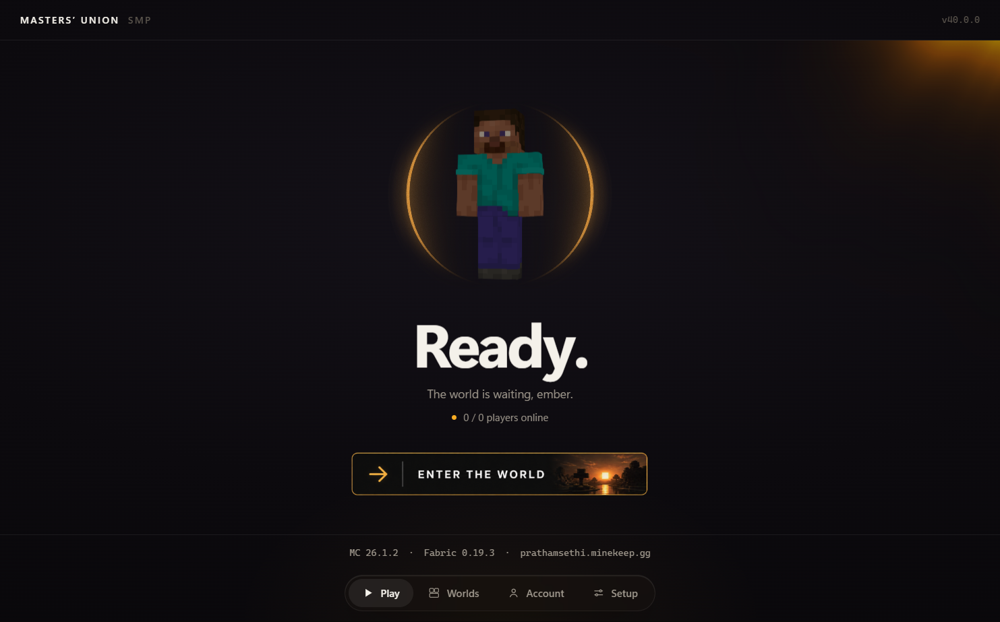
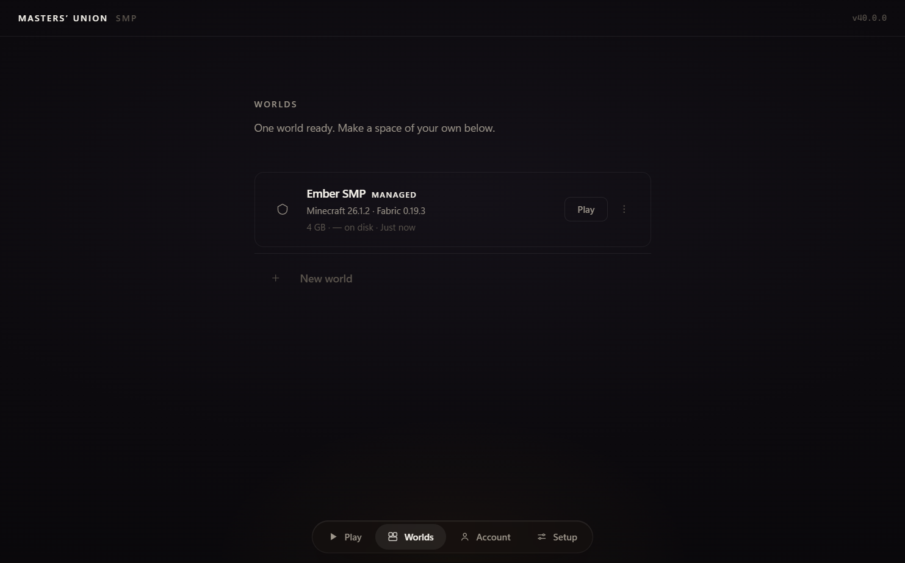

# Ember

a minecraft launcher for the masters' union smp. one click, you're in.

you sign in with the microsoft account you already use for minecraft. ember
downloads the right java for your machine, installs fabric, syncs the server's
mods, points the game at the server, and launches. you don't install java, you
don't install fabric, you don't move jars around. you open ember and press play.
if a mod crashes your game, ember reads the crash report and tells you which mod
did it instead of leaving you with a stack trace.



---

## install

1. go to [releases](../../releases/latest) and download **`Ember-…-Setup.exe`**.
   don't want to install anything? grab **`Ember-…-Portable.exe`** instead — one
   file, extract and run.
2. windows will warn you. that's expected — the build is **unsigned** (see
   [why](#why-does-windows-warn-me)). to get past it:
   - right-click the file → **properties** → tick **unblock** → **ok**, then run it, **or**
   - double-click it and click **more info** → **run anyway**.
3. open ember, sign in with microsoft (the same account you use for minecraft —
   ember never sees your password), pick the world, press play.

the first launch takes a few minutes while it downloads minecraft, java, fabric
and the mods. after that it's fast. ember tells you this before your first
launch, so a slow start doesn't look like a broken app.

### why does windows warn me?

ember isn't code-signed. a signing certificate costs real money per year and
this is a launcher for one smp, so it ships unsigned for now. the two ways past
the warning are above. nothing about the warning means the file is unsafe — it
means windows has never seen this exact binary before, which is true.

## what it does

| | |
| --- | --- |
| one-click launch | auth → java → fabric → mods → server → game, no manual steps |
| java for you | the right JRE for your machine is downloaded from mojang and sha-1 verified |
| mods that match | the server's mod list is synced into your world, hash-checked per file |
| the oracle | reads the crash report and names the mod that caused it, or says so when it can't |
| worlds | managed smp world plus your own personal worlds, each with its own mods, saves and backups |
| backups | save backups with restore and verify, so a bad day isn't a lost world |
| the console | every launch step, live, plus the raw game log — copy-for-support in one click |
| skins | a skin studio: import, preview, equip, saved library |
| low-ram guard | on a machine with under 6 GB of ram it quietly hands java 2 GB instead of 4, and says so once |



## built with

- [electron](https://www.electronjs.org/) + [react](https://react.dev/) + [typescript](https://www.typescriptlang.org/) — the app
- [electron-vite](https://electron-vite.org/) — build
- [tailwind css](https://tailwindcss.com/) — styling
- [fabric](https://fabricmc.net/) — the mod loader it installs and launches
- [minecraft-launcher-core](https://github.com/PrismarineJS/minecraft-launcher-core) — launching minecraft
- [msmc](https://github.com/Hanro50/MSMC) — microsoft login
- [modrinth](https://modrinth.com/) — mod search and updates
- [electron-builder](https://www.electron.build/) — packaging

## the receipts

the repo does the bragging:

- **374 unit tests** across 25 files (`npm test`).
- **11 playwright end-to-end specs** that boot the real app on a throwaway
  profile — boot, navigation, the layout law, journey timing, oracle recovery,
  the first-boot expectation line, and persona sandboxes (`potato-pc`,
  `mod-hoarder`, `corrupted-state`, `flaky-network`).
- **the oracle** is not a promise in a table — it's `src/main/crash-diagnostic.ts`,
  with a test corpus of real crash reports, and an honesty gate that refuses to
  blame a mod that isn't actually installed.
- **adversarial testing**: a nine-attack red-team pass over archive handling,
  path traversal, filename injection, token custody and update sourcing — written
  up in [`docs/project-truth/29-RED-TEAM.md`](docs/project-truth/29-RED-TEAM.md).
- **project truth**: `docs/project-truth/` is a written-down map of the
  architecture, the ipc surface, state ownership, invariants and known risks.

```
npm test          # unit
npm run typecheck # tsc --noEmit
npm run lint      # eslint src/
npm run build     # compile main + preload + renderer
npm run build:electron  # package (nsis + portable)
```

## run it from source

```bash
git clone https://github.com/prathamsethiongithub/mu-launcher
cd mu-launcher
npm install
npm run dev
```

needs node 20+ and windows 10/11 (x64). java is handled by the launcher.

## license

TBD
